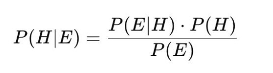
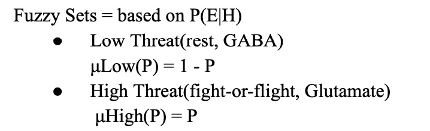
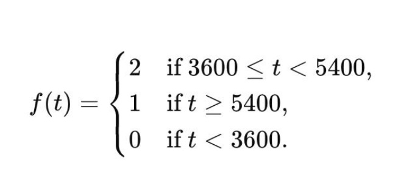
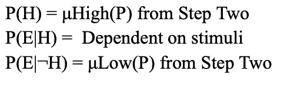

# Consciousness
## Mathematical Framework for Modeling Consciousness

This code uses my Mathematical Framework for Modeling Consciousness and puts it into code. 
You can find my Mathematical Framework for Modeling Consciousness [here](https://heartfelt-fairy-92af03.netlify.app/research)

#### Steps

### The first step is Bayes Inference:


```python
 P_H = 0.78  # Prior Probability (Environment is dangerous)
    P_E_given_H = 0.81  # Likelihood that threat is real based on external stimuli
    P_E_given_not_H = 0.79  # Likelihood that threat is not real

    P_E = P_E_given_H * P_H + P_E_given_not_H * (1 - P_H)  # Marginal Probability
    P_H_given_E = (P_E_given_H * P_H) / P_E  # Posterior Probability
```

### The second step is Fuzzy Logic:


```python
    muLow = 1 - P_H_given_E  # Low Threat
    muHigh = P_H_given_E  # High Threat
```

### The third step is Activation: 


```python
    if 3600 <= time_in_seconds < 5400:
        f_t = 2
    elif time_in_seconds >= 5400:
        f_t = 1
    else:
        f_t = 0

    if f_t == 2:
        print("Glutamate is strongly activated.")
        if time_in_seconds < 3600:
            print("Program stops as t < 3600.")
            return
    elif f_t == 1:
        print("Moderate activation: Extra Synaptic GABA is activated.")
        if time_in_seconds < 3600:
            print("Program stops as t < 3600.")
            return
    else:
        print("No significant activation.")
        if time_in_seconds < 3600:
            print("Program stops as t < 3600.")
            return
```
### The fourth step is Bayes Inference again: 



```python
    P_H = muHigh  # Updated Prior Probability
    P_E_given_H = 0.56  # Likelihood that life is in danger
    P_E_given_not_H = muLow  # Likelihood that life is not in danger

    P_E = P_E_given_H * P_H + P_E_given_not_H * (1 - P_H)  # Marginal Probability
    P_H_given_E = (P_E_given_H * P_H) / P_E  # Posterior Probability

```
### The fifth step is the Turing Proof
It excutes if P(H|E) > 0.80<br> 
Meaning the indivdual has Stockholm Syndrome
and (p ∧ r) ∨ q holds true

p = indivdual with empathy<br> 
r = Stockholm Syndrome<br>
q = indivdual with Anti Social Personality disorder (ASPD) or Narcisstic Personality disorder (NPD)

#### Both can pass the Turing Test 
- One (p) having no free will
- One (q) having no empathy *(ASPD)* or *(NPD)*

```python
  proof_condition = P_H_given_E > 0.80
  if proof_condition:
        print("\nStep Five:\nCondition (P(H|E) > 0.80) is TRUE.")
        print("(p ∧ r) ∨ q holds true.")
  else:
        print("\nStep Five:\nCondition (P(H|E) > 0.80) is FALSE.")
```
